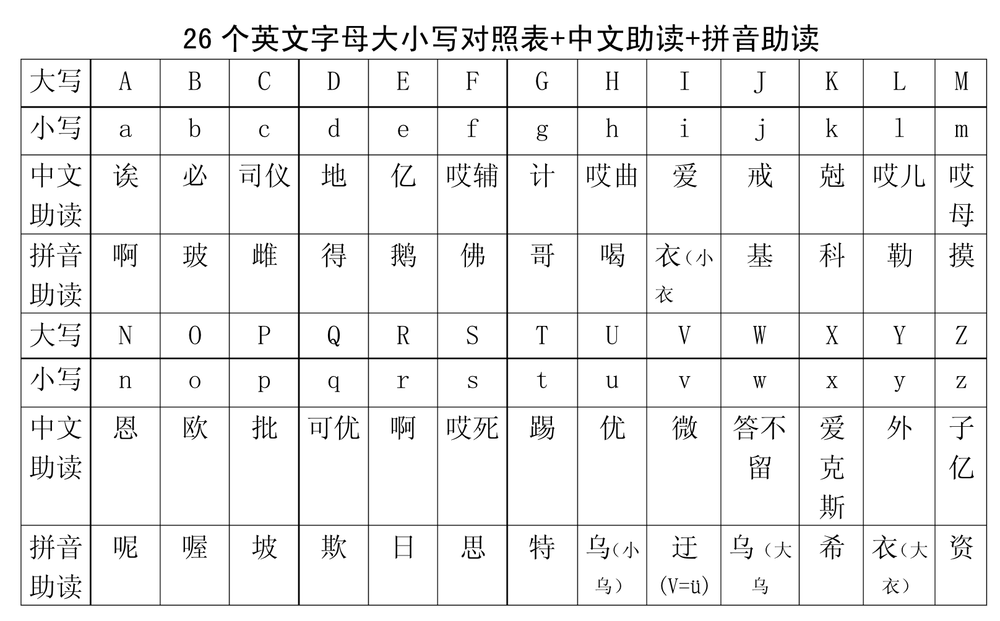
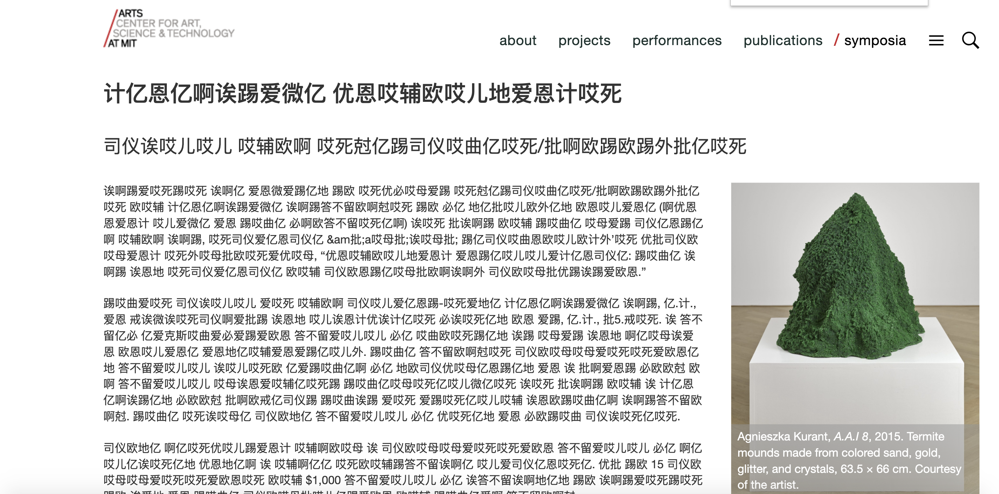

### Translator

This chrome extension is a translator that can help to translate the whole web page from English to Chinese, however, in a transliterating way. 

I referred to this chart 

I translate each letter into its Chinese transliteration. I was inspired by the Google translate chrome extension, which can translate the whole webpage for users, very badly. Everytime I used this extension, it became even harder for me to understand. Also, I was inspired by the way that my grandparents learn English. They just wrote down all the pronunciations in Chinese, which is quite interesting. 

Original web page

Changed web page

