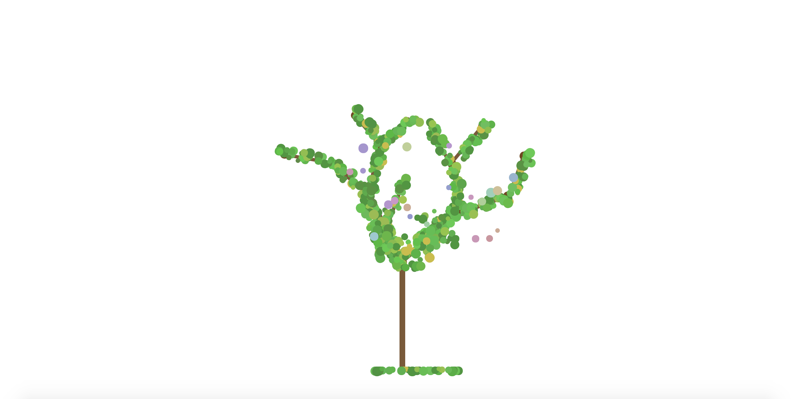
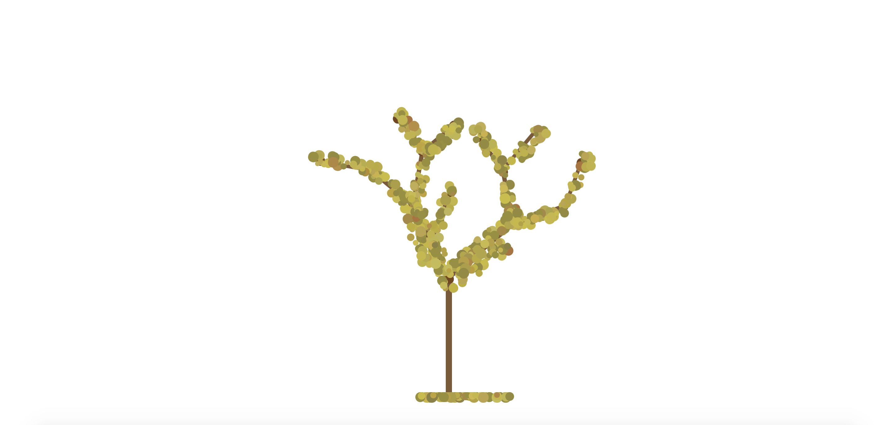

#### Growth

This project is about a growing tree. 
The tree will firstly grow branches, 
Then some leaves, 
And some more leaves, 
Finally flowers and fruits. 
Some leaves may fall down. 
Some leaves will turn yellow slowly. 
However, if you try to speed up the growing,
If you move the slider on the branches,
The tree will no longer blossom and bear fruit.
So please be patient,
Wait for the tree to grow, to bloom, to fruit.

I encountered several changes during the developing process. Firstly, different from styling other elements, it's much more complicated and tricky to style a range input element, even if I just want to change its color. To do this, we need to override their basic appearance. When I searched online, I found that a common way to style the range input to have different colors before and after slider is to create a div to cover the input bar and change its width as the slider move. However, since I rotated the inpur bars as the branches, it's almost impossible to keep the div perfectly cover the input bar. Therefore, I can only change the color of the whole input bar to brown.

Secondly, when the width of the rotated input element changing, its positioning would change. Therefore, I need to mark down two different data of its positioning before growing and after growing, and then use a map function to keep it looks like staying in the same position. However, it still looks a little shivering when growing. 

Thirdly, it's hard to position the leaves. I want them to grow randomly around the branches. I put a transparent div as the container of the leaves over each branch, and append the leaves into different divs. 
This brings me another problem. When making the falling leaves fall down, since their positionings are set according to the div, and the divs are rotated, it's hard to tell each leaf where to go. By simply add up the positioning on y-axis, the leaf will fly to some other directions since the div holding them are rotated. To solve this problem, I created an unrotated div to hold some more leaves, and make the leaves from that div fall down. 

Finally, to make the leaves in different greens, I used hsl color mode. I set the hue to a static number, and change the stauration and lightness in a certain range to generate different greens. I also use hsl color to change the green color to yellow color gradually by changing the hue data.

I think there are many possibilites for further development. I still have many other functionalities to add. For example, make the leaves shake when wind blows, and new trees can grow up after some fruits falling down. 
