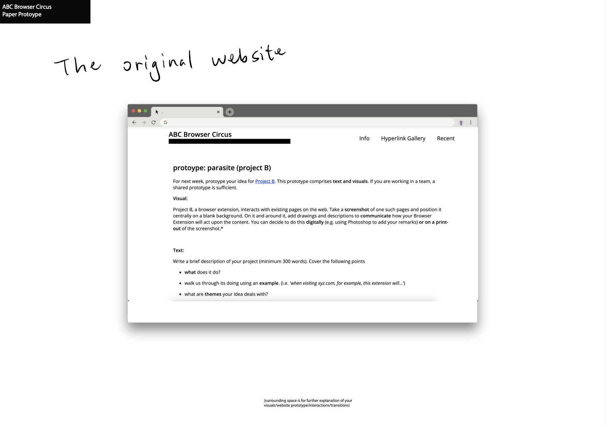
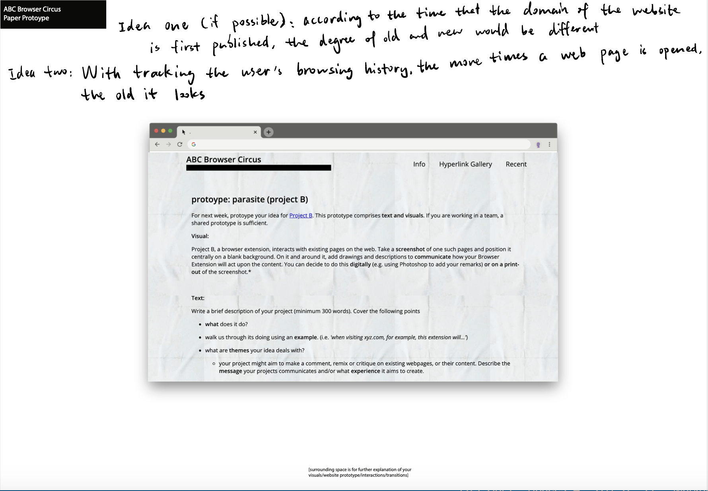
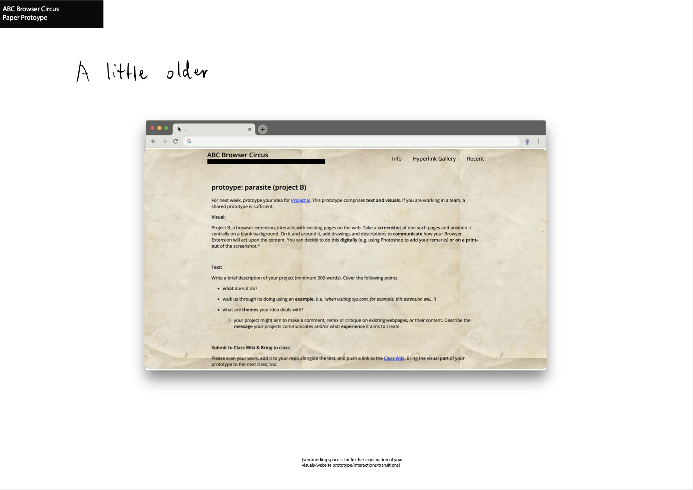
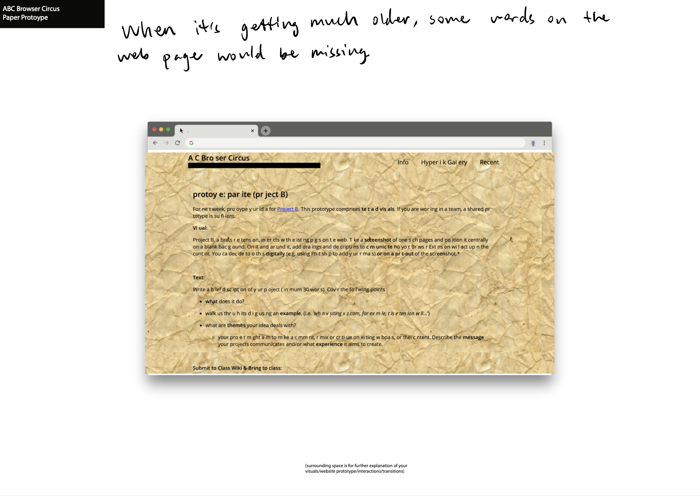
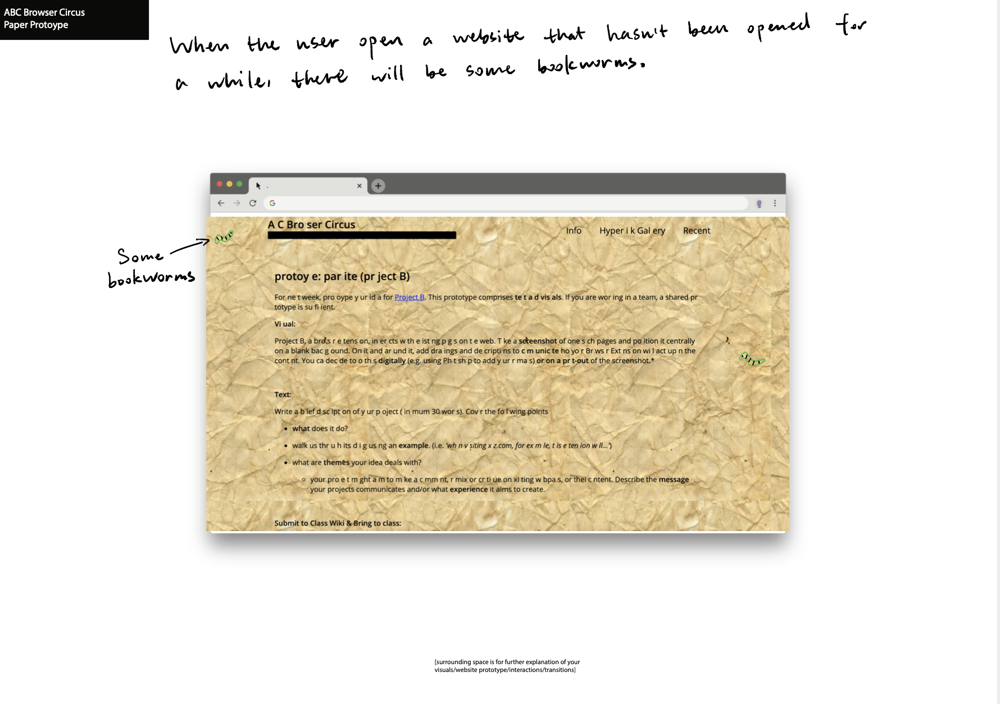
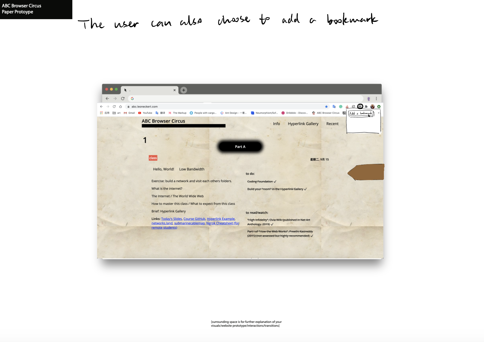

### WEBBOOK

Our project is called “webbook”. As its name suggests, the project is about making websites look like books. The websites resemble books not only in appearance, but also in experience. For example, when the user is browsing the window, the website would “flip over” the page instead of scrolling through the content. And as the user visits the websites for many times, the websites will become “old”, just like when we read one page for several times the page will be more crumpled than the ones not read yet. Some words may also disappear from the websites as the websites have been visited for so many times. This is analogous to the old books in real life in which some of the pages have been used to such an extent that the characters become illegible. There may also be some little book worms on the pages. Besides the “old” experience, the user could also make a bookmark of where they’ve been at before. Specifically, the extension would record the last scrolling position of the last page the user has visited. When the user opens chrome again, the extension will direct the user to where they’ve been at before.

Our project aims to create a web experience of reading and using something. It’s called “webbook”, but it’s not simply giving the web book-like features. It renders the website as a real object, something that “remembers” the user’s behavior and reflects in its appearance and using experience. We come up with this idea because the websites are too often seen as a quick tool that is disposable and left with no attention. However, in real life we would treat objects with more care and there will be traces of our behavior left on it. The project aims to bridge the gap between a physical object (not necessarily books) and a virtual object (the websites, in this case).
