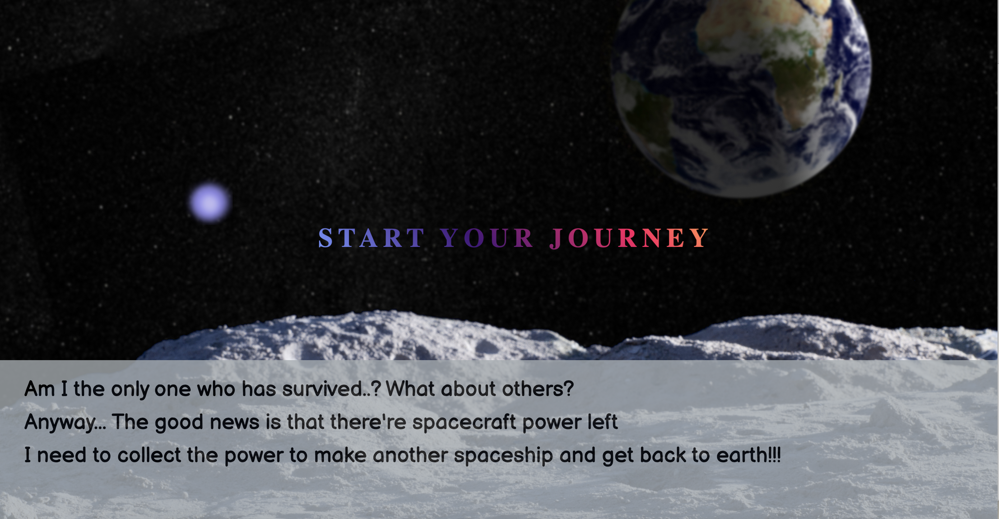
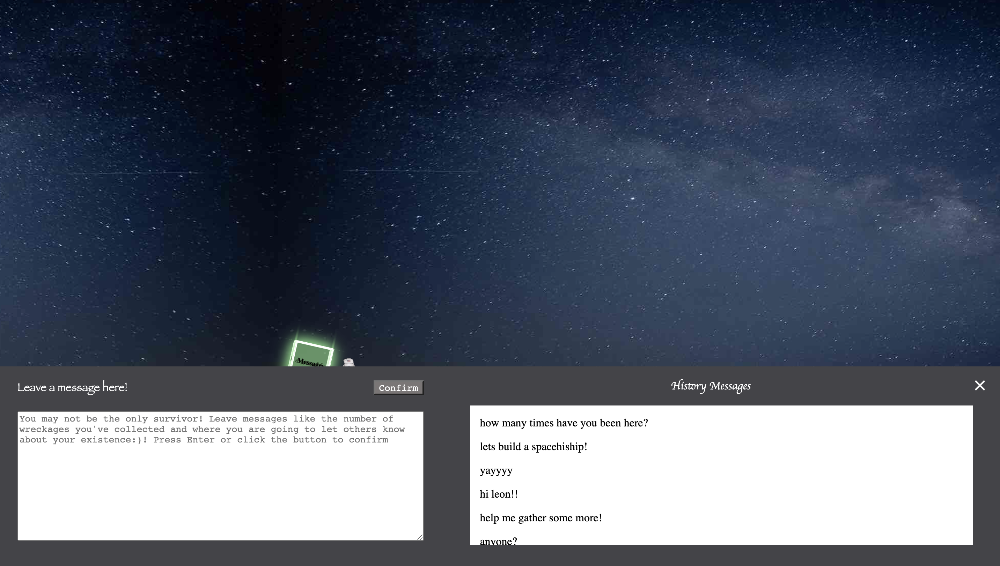
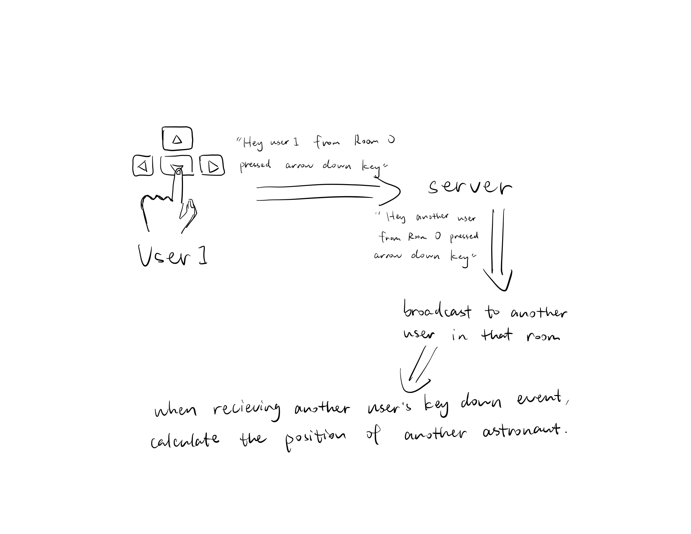
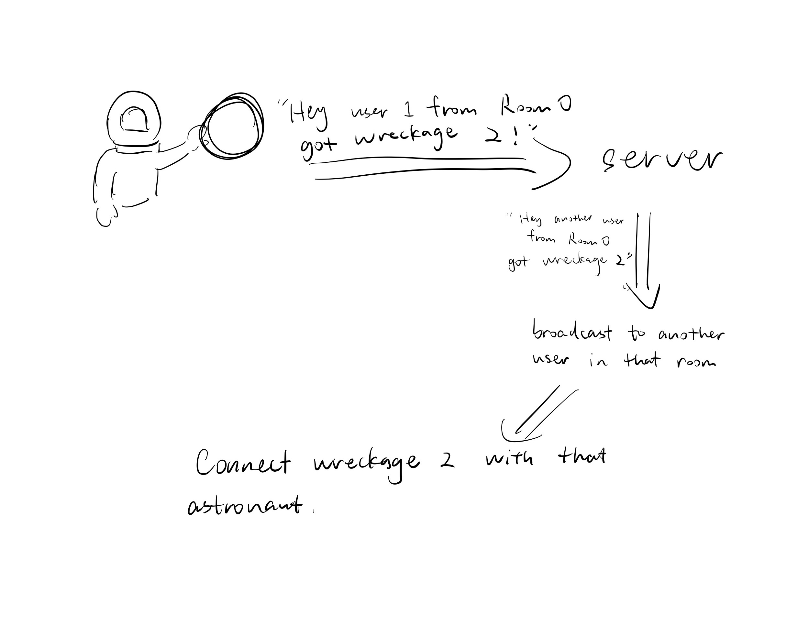
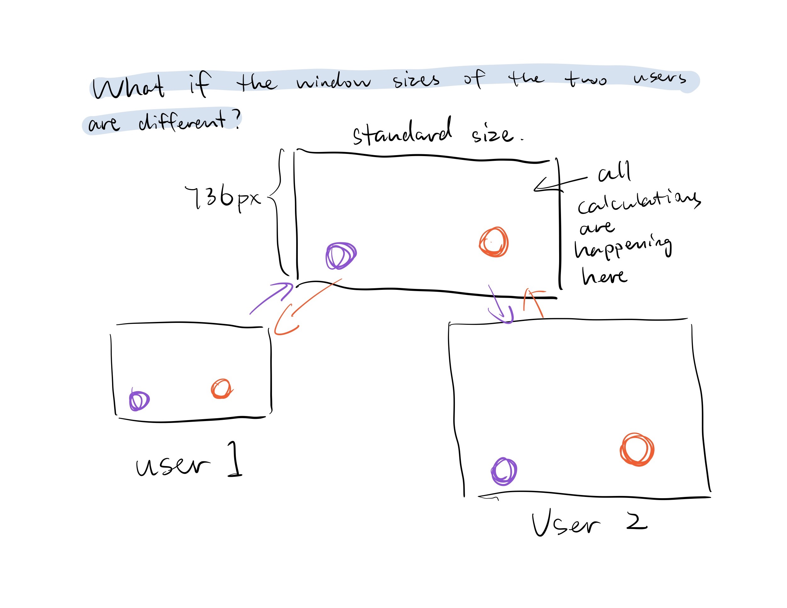
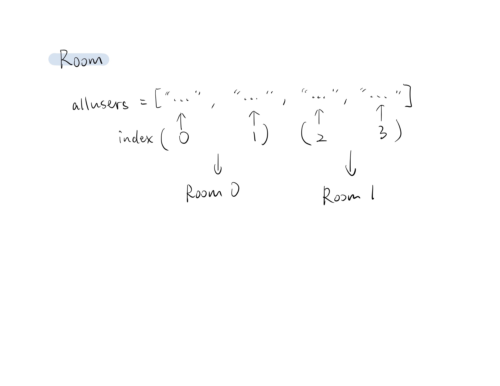
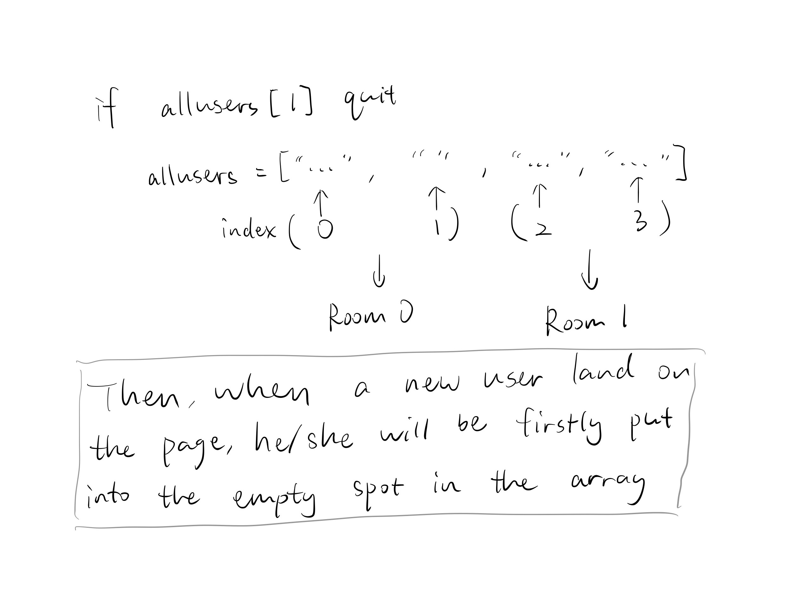

# INTRO: On the Moon
[link to the project](https://on-the-moon.glitch.me/)

Imagine you were an astronaut who were on a mission to the moon. However, the spacecraft exploded when arriving at the moon. Fortunately, you survived and accidently found yourself on the moon. You wonder if you were the only survivor. But it seemed that for now you could only do something with the wreckage power beside you. The power appealed to you--- the rule is that you could always collect them to form a new spacecraft. That’s how your journey starts.

The paragraph above is the background introduction at the beginning of our project. An important purpose of this intro is to let users know that they are currently alone while also to infuse them with a little bit expectation that there may be other users on the same page. Such expectation will not realize, however, until the user starts his/her power collection journey and accidently meet others on the way. Just as the prompt goes, we want to construct the website as a “space of encounter” in which people meet each other. Such “meet” may be expected, or maybe not. That’s how in reality meet works too. You never know what and who you are going to encounter. The context we construct could enhance the meeting experience even more. Under such a disastrous background, people will find it more precious to meet others. Collaborating with other to achieve the same goal would even strengthen the bond between two strangers.  

Everything we build revolves around the two concepts: encounter and collaboration. For example, the message box is for the sake of leaving traces. Landing alone on the moon, you may wonder if there’re other survivors. The message box is for you to leave your trace and expect. In addition, there’re 6 powers in total to be collected. However, you would find that you could only collect 3. This suggests the necessity of another person’s existence. Collaborative efforts are required to finish this task.

  

After all the 6 powers have been collected, the users will be directed to a merge area where they could form a new spacecraft and get back to earth.

# TECHNICAL CHALLENGES
This project involves many techniques. The main ones are positioning, sizing, socket room setting, server-client as well as database communication.

1. Database communication with socket room

Since each two players are assigned in the same room, the message boxes should also be specific to the room. Database is used to store the messages. To retrieve the data for specific room, each time the user sends a message a room number will also be sent with him/her. Then in the javascript the room number sent by user will be compared with the room number stored (the actual). If the two values are equal, then the data will be retrieved and the archived messages will appear specifically in the room.

2. What to constantly update and what to keep executing once

Since there're a lot of conditions that would be met when the users move, the movement needs to be constantly checked. Yet sometimes the things that follow after a certain meeting condition need only to be executed once and such update would make it chaos. We figure out two solutions. The first is to use boolean value to constrain the activate times. The other is to store the new info in an array and check the array. For example, when the users approach the spacecraft, the server will constantly receive the "spacecraft approach" message and push users' ID. The solution is to store all the info in an array and check if the array has two different values, i.e. if two users are both included.

3. Sync the positions of two astronauts and six wreckage powers

In the previous project, we found that sending the position data through server everytime the position of any element changes would cause a "traffic jam" when communicating since there are too much data sending around in a very short time, and the page would be super slow and fail to sync the positions well. Therefore, this time we make the webpage listen to the key events. Everytime the user press down the arrow keys, the keyDown data would be sent to the server with the room number, and then the server would send the data to another client in that room if exists. The position of another astronaut would be calculated also on the user's page according to the keyDown data.

The positions of the wreckages also work in a similar way. Everytime one astornaut collects one wreckage, the data would be sent to the server and then to another user in that room. The position of the wreckage would calculated on every user's page separately with the force applied to each wreckage. Therefore, the position of each wreckage may be slightly different on each page, but are still attached to the astronaut that they should attach to.

4. Fit to different window sizes

To make sure that our project looks the same and fits different browser window size, the positions of all the elements should be calculated in proportion instead of fixed numbers. However, if calculates all the positions based on proportions, that would be difficult to calculate and very abstract. Therefore, I set a standard number of the window height as 736px. The actual position on each page then is (window.innerHeight / 736) * x. Since I calculate the position on the actual page with this formula, I can use fixed numbers to calculate in other places.

5. Put the users to different rooms

We put all the users in an array and put every two users in one room. If one user quit, that index would be set to empty. Then, when a new user land on the page, that user will be firstly put into that empty spot in the array, so that no user would play the game alone.

# Compromises
1. The Merging animation

First we think of making the powers rise and merge in the center of two users. However, as we do the calculation, which involves viewport position and users' absolute position to the canvas as well as users' distance, we found that the merged power position only works on one user's view.

In addition, if we want to move the wreckage to a desired position it will conflict with its own movement (spring and go with the astronaut). The wreckages' movements constantly update so it's hard and unnatural to suddenly modify or stop it.

Due to the viewpoint complexity and conflicting movement, we abandon the idea and use disappear instead. The effect looks good actually.

# Shortcomings
1. Players limit

Due to technical complexity and time limit we set it as a two-player game. But definitely if we have more time we will try to figure out how to make it a multi-player game, i.e, include more people in the room. This will make the game even more fun!

2. More hints about another user's presence

Since the user enters the game page without knowing another person's existence, meeting someone on page suddenly may seem a little bit abrupt. We agree to Dave's suggestions and think it would be better if we give some hints about another person's presence so that the user would be more activated to move around.

3. The moon canvas

Currently the moon canvas is a long picture and the user will go to the end. If the canvas is annular then the experience of encountering and exploring will definitely be more fun.
